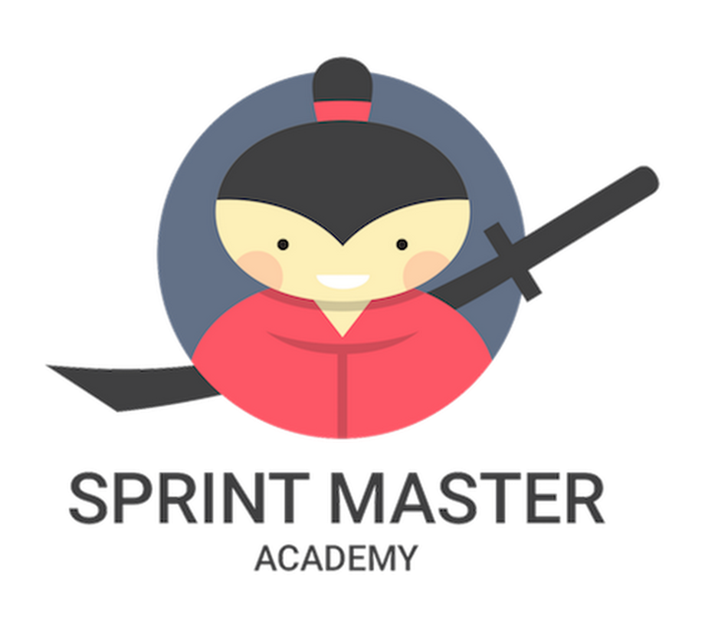
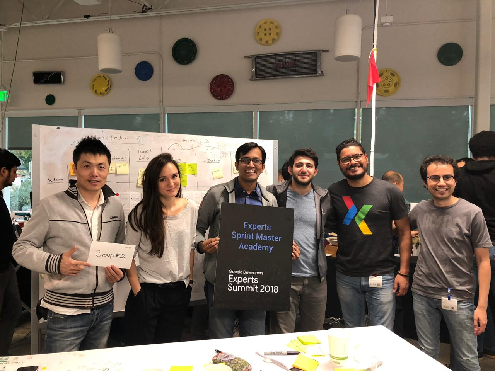

# sprint-master

Sprint Master is a five-day process for solving problems and testing new ideas.

> Sprint - How to solve big problems and test new ideas in just 5 days.  
> 冲刺！ - 五天：从面临挑战到验证解决方案

## DECKS

1. [Google Design Sprint Master Workshop](https://docs.google.com/presentation/d/12rHQtDeTL1NlbYF_YntruT33crdtSMUWGDI8JweghHU/edit?usp=sharing)
1. [Google Desigh Sprint Master Deck - Huan (private)](https://docs.google.com/presentation/d/1p1F3BMdyeZOwLUb6m9zJD_l0G6U16NQDjq-CXp9q27U)

## RESOURCES

1. [Google Venture - Sprint Week](https://library.gv.com/sprint-week-set-the-stage-99f2f29ce0e7)
1. [Google Venture - The Design Sprint](http://www.gv.com/sprint/)
1. [Google Design Sprint Kit](https://designsprintkit.withgoogle.com)

## About Google Expert Design Sprint Master Academy

The Google Expert Design Sprint Master Academy teaches Google employees and experts the Google Ventures Design Sprint methodology. This framework is a five-phase process that helps teams answer business questions by designing, prototyping, and testing ideas with users. Sprints can compress months of time into 3–5 days, allowing teams to learn quickly without building and launching. The Design Sprint follows six phases:
Understand, Define, Sketch, Decide, Prototype, and Validate. 

The Design Sprint follows six phases: Understand, Define, Sketch, Decide, Prototype, and Validate.
The academy offers courses that teach skills and knowledge beyond workshop agenda facilitation and flow control. These include: Product Management, Business model, UX Design, Design Thinking, and Service Design. 
The academy also offers 2-day Design Sprint Training, which includes case studies and interactive-style teaching. 
To become a Recognized Design Sprint Master, you need knowledge gained from the Sprint Book, Google Design Sprint Kit, or through participation in online or in-person design sprint courses. You also need experience as a design sprint facilitator/co-facilitator or as an active participant in a live design sprint workshop. 

## AUTHOR

[Huan Li](http://linkedin.com/in/huan42), Google Design Sprint Master, Certified by Google Expert Design Sprint Master Academy, March 15, 2019; Chief Coach & Co-founder of [Venture Sprint](https://venturesprint.net)

## COPYRIGHT & LICENSE

* Code & Docs © 2016-now Huan Li \<huan@chatie.io\>
* Code released under the Apache-2.0 License
* Docs released under Creative Commons

